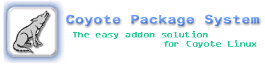
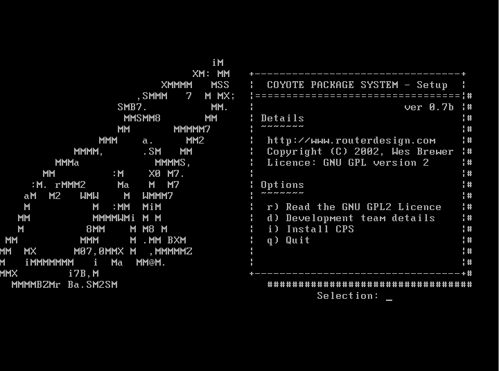

# coyote-package-system

An unofficial package system for the now defunct Coyote Linux, a routing centric Linux distribution which fit on a floppy disk. From an earlier time when space and resources were precious!

**tldr:** Coyote Linux and this package system are long discontinued! This has been uploaded here for archival purposes.

The commit dates will reflect when they were pushed to github, not when I originally created them as I wasn't using any version control system at the time.

I have done a commit for each version change I have available for completion sake.

More info about Coyote Package System (CPS) and related packages can be found below:

Coyote Linux was a router/firewall centric Linux distribution. At the time, Coyote lacked proper support for package management (eg. deb/rpm) and as such Coyote Package System (CPS) was created.

CPS allowed for easy installation of add-ons within Coyote Linux by use of .cps package files which are similar to the .lrp files from the Linux Router Project. This package manager handled and installed add-on software within Coyote via an easy to use menu system.

Coyote Package System works with the following versions of Coyote Linux:

* Coyote Linux 1.2 and v1.3x (with CPS version 0.7b)
* Coyote Linux 1.40rc1 (with CPS version 0.8b in the development branch)

Development of the floppy disk version of Coyote Linux and CPS has been discontinued. Coyote Linux v2.x had later been forked over to BrazilFW. CPS has never been tested with BrazilFW!

## Features

* easy to use (the CPS sub-menu is patched into the Coyote Linux main menu)
* many Linux Router Project .lrp packs can be converted to .cps packs. (see build instructions in the blank template package)
* supported easy package installation, configuration, and removal
* help is available within the menu
* no need for the user to build software from source

## Later Versions

CPS v0.9 was a work in progress with support for Coyote Linux versions 2.x. It was being worked on by Rusty Martin (Omega_Monk) of the dev team and myself. The code was never fully tested and we somehow managed to misplace it. It is forever lost, and development on CPS has long since stagnated.

## Installation

See [cpsmanual.html](docs/cpsmanual.html) in docs/

## Documentation

[changlog.txt](docs/changelog.txt) and [todo.txt](docs/todo.txt) can be found in docs/

## Packages

Packages for CPS can be found under the cps-packages repository.

## Dev Team

Code improvements, testing and feedback credit go to these amazing volunteers.

* Rusty Martin (omega monk)
* Mel Kliner (northern rebel)
* Andrew Barnes (canuckle)

## Screenshots

More screenshots..

1. [Coyote menu before CPS](docs/.screenshots/Coyote_menu_before_installing_CPS.png)
2. [Coyote menu after CPS](docs/.screenshots/Coyote_menu_after_installing_CPS.png)
3. [CPS Install Finished](docs/.screenshots/CPS_installed.png)
4. [CPS menu](docs/.screenshots/CPS_submenu.png)
5. [Install a package (1 of 4)](docs/.screenshots/CPS_install_package_1.png)
6. [Install a package (2 of 4)](docs/.screenshots/CPS_install_package_2.png)
7. [Install a package (3 of 4)](docs/.screenshots/CPS_install_package_3.png)
8. [Install a package (4 of 4)](docs/.screenshots/CPS_install_package_4.png)
9. [Remove a package](docs/.screenshots/CPS_remove_package.png)
10. [Uninstall CPS](docs/.screenshots/CPS_uninstall.png)

More still can be found under docs/.screenshots
